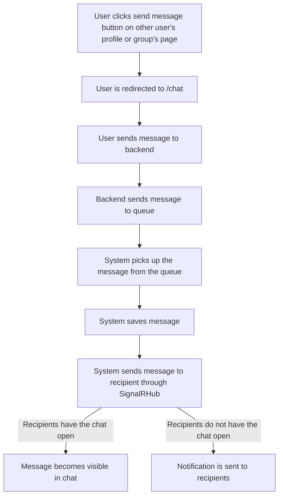
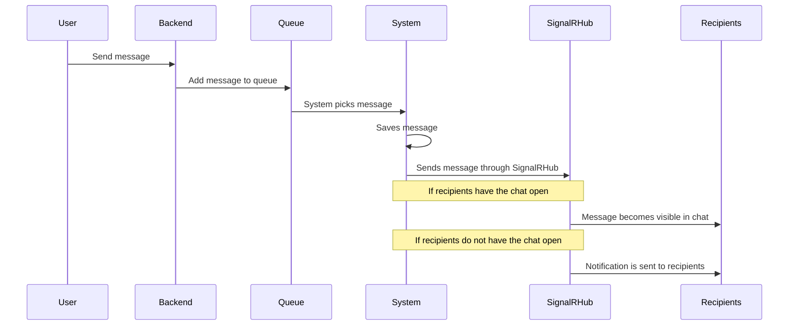

# Chat

## Start Chat Flow:

1. User clicks send message button on other user's profile or group's page
1. User is redirected to the /chat page, where a new chat is opened
1. User sends message to backend
1. System sends message to topic
1. System picks up the message from the queue
1. System saves message
1. System sends message to recipient through SignalRHub
1. Recipient can now see the message if they have the chat open, otherwise they get a notification

---

### Flowchart

### Sequence Diagram

